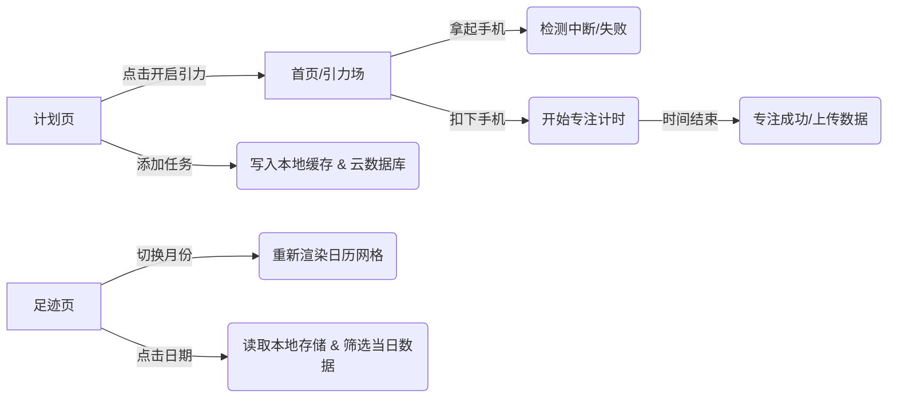

# 引力番茄 (Gravity Pomodoro)

## 1. 产品功能介绍 (Product Function Introduction)

**项目名称**：引力番茄 (Gravity Pomodoro)
**项目定位**：一款结合“物理交互”与“量化自我”的极简专注力管理工具。旨在通过强制性的物理动作（扣下手机）帮助用户脱离手机干扰，进入心流状态。

**核心功能模块**：

1. **引力场 (Focus Mode)**：
* **物理启动**：利用手机陀螺仪/加速度计，只有将手机屏幕朝下扣放在桌面上时，计时器才会启动。

* **防抖动机制**：智能识别细微震动，防止误触导致计时中断。

* **沉浸体验**：专注开始时自动降低屏幕亮度并震动反馈，拿起手机时触发“引力场破裂”惩罚机制。

* **每日语录**：调用云端 API（一言），每次专注前展示一句激励语录。

  

  


2. **作战计划 (Todo List)**：
* **任务管理**：支持快速添加待办事项，标记“心流模式”任务。

* **状态同步**：任务完成状态与本地缓存同步，支持右滑/点击完成交互。

* **云端记录**：创建任务时自动同步至云数据库，用于后续分析。

  


3. **足迹档案 (Calendar & Statistics)**：
* **可视化日历**：自定义开发的月视图日历，直观展示每月的专注情况。

* **数据回溯**：点击日历上的任意日期，下方面板实时显示该日的任务数、心流次数及具体任务日志。

* **视觉反馈**：通过绿色高亮和红点标记，直观呈现用户的努力轨迹。

  


---

## 2. 程序概要设计 (Program Summary Design)

### 2.1 页面流程图



### 2.2 数据存储设计

本项目采用了 **本地存储 (Storage)** 与 **云开发数据库 (Cloud DB)** 相结合的混合存储策略。

* **本地存储 (`wx.setStorageSync`)**：
* Key: `tasks`
* Value: `Array<{ id, content, isFlow, completed, createTime }>`
* *目的*：保证应用在无网络环境下依然流畅，实现“秒开”体验。


* **网络请求 (`wx.request` & Cloud)**：
* API: `https://v1.hitokoto.cn/?c=i` (获取每日语录)
* Cloud DB Collection: `focus_logs` (存储专注成功/失败的详细日志)


---

## 3. 软件架构图 (Software Architecture)

本项目遵循微信小程序标准的 **MVVM (Model-View-ViewModel)** 架构模式。


## 4. 技术亮点及实现原理 (Technical Highlights)

### 4.1 基于加速度计的物理交互 (Hardware Sensor)

* **亮点**：打破传统的“点击开始”交互，利用 `wx.onAccelerometerChange` 监听手机姿态。
* **实现原理**：
  监听 Z 轴加速度，当 `res.z < -0.8` 时判定为手机扣下。
  为了解决极其灵敏的传感器导致的误判，引入了 **防抖计数器 (Debounce Counter)**：只有连续检测到 5 次以上的“非扣下状态”，才判定为用户拿起了手机。
```typescript
// 核心代码片段
if (res.z < -0.8) {
   startFocus(); // 扣下
   this.data.liftCounter = 0; // 重置计数器
} else {
   this.data.liftCounter++; 
   if (this.data.liftCounter > 5) triggerExplosion(); // 确认拿起
}

```


### 4.2 响应式 CSS Grid 日历算法 (CSS Grid Layout)

* **亮点**：纯手写的日历组件，实现了年份、月份、星期的完美对齐，且在不同尺寸屏幕上保持正方形格子的自适应。
* **实现原理**：
  使用 CSS Grid 布局的 `repeat(7, 1fr)` 将宽带均分。最关键的技术点是使用了现代 CSS 属性 **`aspect-ratio: 1`**，强制让每个日期格子（无论宽度如何变化）的高度始终等于宽度，从而形成完美的正方形网格。
```scss
.calendar-grid {
  display: grid;
  grid-template-columns: repeat(7, 1fr);
  gap: 14rpx; /* 统一间距确保对齐 */
}
.day-cell {
  aspect-ratio: 1; /* 核心：宽高比锁定 */
}

```


### 4.3 沉浸式体验优化 (Immersion Optimization)

* **亮点**：通过控制屏幕常亮和亮度，模拟“休眠”但实际运行的效果。
* **实现原理**：
* 在 `onLoad` 调用 `wx.setKeepScreenOn` 防止手机自动锁屏导致计时器暂停。
* 在开始专注时调用 `wx.setScreenBrightness({ value: 0.1 })` 调暗屏幕省电；结束时恢复亮度。


---

## 5. 性能优化与总结 (Performance & Summary)

* **性能优化**：
1. **资源释放**：在页面 `onUnload` 生命周期中，强制调用 `wx.stopAccelerometer` 停止传感器监听，并清除 `setInterval` 定时器，防止内存泄漏。
2. **渲染优化**：日历组件中只渲染当月数据，非当月日期不参与渲染，减少 DOM 节点数量。


### 提交附言 (Submission Note)

**作业提交要求 check list：**

* [x] **产品报告**：即本文档。
* [x] **功能要求**：实现了专注计时、待办清单、日历统计三个模块。
* [x] **技术要求**：使用了 Storage (任务存储) 和 Network (一言API/云开发)。
* [x] **性能要求**：无明显资源泄露 (已做销毁处理)。
* [x] **源代码**：已上传至代码仓库。

**Git 仓库地址**：
*[Sandy-wxy/Gravity-Pomodoro](https://github.com/Sandy-wxy/Gravity-Pomodoro)*
